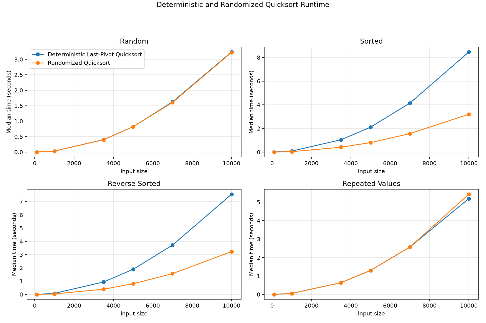
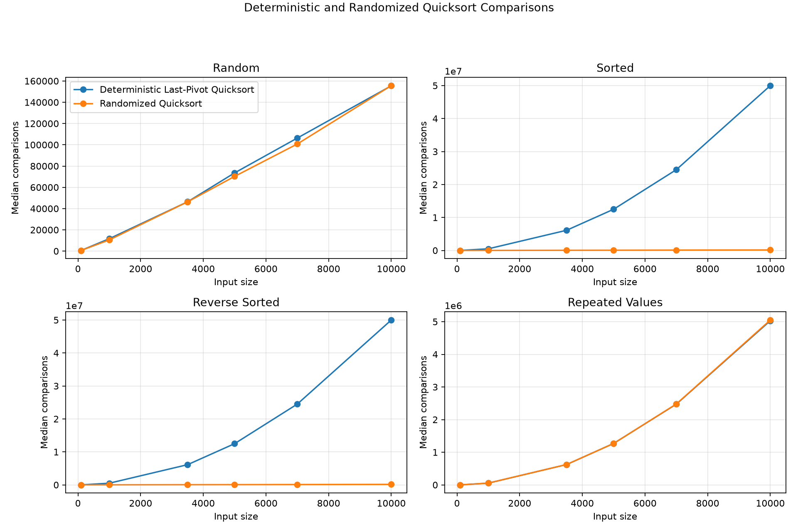

# Assignment 5 Report

## Quicksort Algorithm: Implementation, Analysis, and Randomization

- **Student:** Ashish Mahajan
- **Course:** MSCS 532-B01 - Algorithms and Data Structures
- **Instructor:** Dr. Michael Solomon
- **Repository:** [MSCS532_Assignment_5_AM](https://github.com/AshishM26/MSCS532_Assignment_5_AM)

## 1. Introduction

Quicksort selects a pivot, partitions the active region, and sorts the resulting subproblems. This project compares final-element and uniformly randomized pivots while keeping in-place Lomuto partitioning constant.

## 2. Assignment Objectives

The objectives were correct implementations, rigorous complexity analysis, reproducible empirical comparison, input preservation in copy mode, and stack safety on ordered data.

## 3. Deterministic Quicksort Design

Deterministic Quicksort always selects `values[high]`. It recursively processes the smaller region and iterates through the larger region, protecting Python's physical stack without changing the pivot rule, logical tree, or quadratic worst-case work.

## 4. Lomuto Partition Design

The shared partition function uses `values[high]` as the pivot. It scans indexes `low` through `high - 1` once. When a value is less than or equal to the pivot, the boundary of the left region advances and the value is exchanged into that region. Finally, the pivot is exchanged with the first element of the right region.

One comparison is recorded for each scanned array value compared with the pivot. An exchange counts as a swap only when its two indexes differ; self-swaps are omitted. Thus, a partition of \(n\) active elements makes exactly \(n-1\) counted comparisons and uses \(O(1)\) partition auxiliary space.

## 5. Randomized Quicksort Design

Randomized Quicksort creates a local `random.Random(seed)` instance. For each nontrivial subarray, it selects an index uniformly from the inclusive range \([low, high]\), records the choice, swaps that value into `high`, and calls the same Lomuto function. It never calls `random.seed()` or modifies module-global random state.

The shared partition isolates pivot policy as the experimental difference. A fixed seed reproduces pivot choices and metrics.

## 6. Input Validation and Edge Cases

Public functions require lists of non-Boolean integers. Partition bounds satisfy \(0 \leq low \leq high < len(values)\). Tests cover required edge cases, invalid inputs, copy preservation, and same-object in-place behavior.

## 7. Correctness Discussion

Immediately before each Lomuto loop iteration, the scanned subarray has three regions: values through the left boundary are at most the pivot, scanned values after that boundary are greater than the pivot, and remaining values are unclassified. Processing the next value preserves this invariant by either extending the left region or leaving the value in the greater-than region. Placing the pivot after the left boundary establishes the required final partition.

Quicksort correctness follows by induction on subarray size. Empty and one-element regions are already sorted. For a larger region, partition puts the pivot in its final sorted position. The inductive hypothesis sorts both strictly smaller regions, so their concatenation with the pivot is sorted. Automated tests check this invariant and compare complete results with Python's trusted `sorted()` output.

## 8. Best-Case Time Analysis

When pivots repeatedly divide the input into two approximately equal regions, each recursion level performs \(\Theta(n)\) total partition work and the tree has \(\Theta(\log n)\) levels:

\[
T(n)=2T(n/2)+\Theta(n).
\]

The Master Theorem or a balanced recursion tree gives:

\[
T(n)=\Theta(n\log n).
\]

Perfect balance at every node is not required for this growth; consistently bounded partition ratios are sufficient.

## 9. Average and Expected-Case Time Analysis

For a randomized pivot with sorted rank \(q\), the two subproblem sizes are \(q-1\) and \(n-q\). Every rank has probability \(1/n\), producing:

\[
E[T(n)] =
\frac{1}{n}\sum_{q=1}^{n}
\left(E[T(q-1)] + E[T(n-q)]\right)
+\Theta(n).
\]

The expected recursive work averages across every possible split, and the linear term represents partitioning. Substitution or the standard expected-comparison analysis bounds the recurrence by \(O(n\log n)\); comparison sorting supplies the corresponding expected lower bound in the general case, yielding expected \(\Theta(n\log n)\) (Cormen et al., 2022). Individual partitions need not be balanced. Instead, sufficiently balanced splits occur often enough that the expected total depth-weighted work remains logarithmic per element.

For random input order, deterministic final-pivot Quicksort also has average \(\Theta(n\log n)\) behavior because the final value's rank behaves like a random rank. Randomized selection makes this expectation less dependent on the original ordering.

## 10. Worst-Case Time Analysis

If every pivot is the smallest or largest active value, one subproblem has size \(n-1\) and the other is empty:

\[
T(n)=T(n-1)+\Theta(n)=\Theta(n^2).
\]

Ascending unique input always makes the final element the largest deterministic pivot. Descending unique input makes it an extreme pivot at every level as well. At \(n=10{,}000\), the expected deterministic count from summing \(1+2+\cdots+9{,}999\) is 49,995,000 comparisons, exactly matching the CSV.

Randomization makes a long sequence of extreme pivot ranks unlikely and removes systematic dependence on initial ordering. It does not make that sequence impossible, so randomized Quicksort retains a \(\Theta(n^2)\) mathematical worst case.

## 11. Space Complexity and Stack Behavior

Lomuto partition itself uses \(O(1)\) auxiliary space. A naive recursive Quicksort has expected stack depth \(O(\log n)\) and worst-case depth \(O(n)\). This implementation recurses only into the smaller partition and iterates over the larger one, limiting the physical Python call stack to \(O(\log n)\), even when logical depth reaches \(n\).

Copy mode creates an \(O(n)\) list copy to preserve the caller's input. In-place mode avoids that full output copy. The requested measured implementation also stores an \(O(n)\) pivot trace and counters; this instrumentation is additional experimental memory, not part of the constant-space partition operation.

## 12. Experimental Methodology

The benchmark compared deterministic last-pivot and randomized Quicksort on sizes 100, 1,000, 3,500, 5,000, 7,000, and 10,000. Distributions were random mostly unique integers, ascending unique integers, descending unique integers, and values drawn from 0 through 9.

Fixed seeds made datasets and randomized pivot schedules reproducible. Each combination used an untimed warm-up and five measured trials. Every trial received a fresh input copy, used `time.perf_counter()`, and was verified against Python's `sorted()`. Dataset creation, CSV writing, and chart generation were excluded from timing. The CSV records median, mean, standard deviation, minimum, maximum, comparisons, swaps, partitions, logical calls, depth, pivot selections, and failure details.

## 13. Runtime Results

The size-10,000 results from the 48-row CSV are:

| Distribution | Algorithm | Median seconds | Comparisons | Swaps | Logical depth |
|---|---|---:|---:|---:|---:|
| Random | Deterministic | 3.238983 | 155,468 | 81,230 | 29 |
| Random | Randomized | 3.224975 | 155,656 | 75,344 | 31 |
| Sorted | Deterministic | 8.466383 | 49,995,000 | 0 | 10,000 |
| Sorted | Randomized | 3.199326 | 152,462 | 10,072 | 30 |
| Reverse sorted | Deterministic | 7.556488 | 49,995,000 | 5,000 | 10,000 |
| Reverse sorted | Randomized | 3.234181 | 153,721 | 60,164 | 31 |
| Repeated values | Deterministic | 5.194373 | 5,031,031 | 19,039 | 1,049 |
| Repeated values | Randomized | 5.426506 | 5,051,490 | 29,954 | 1,051 |

These measurements are specific to this run; no significance test was performed.

## 14. Comparison-Count Results

Comparison counts provide a less system-dependent view than elapsed time. Random unique inputs produced about 155,000 comparisons for both algorithms at size 10,000. Deterministic ordered inputs produced 49,995,000, visibly following quadratic growth. Randomized ordered inputs remained around 152,000–154,000 comparisons, consistent with expected \(n\log n\) growth.

The deterministic sorted case recorded zero swaps under the documented counting rule because every `<= pivot` placement and final pivot placement was a self-swap. This does not imply zero work: the algorithm still performed nearly 50 million comparisons.

## 15. Deterministic Versus Randomized Interpretation

Random unique inputs produced similar medians because the final deterministic value was not systematically extreme. On ordered unique data, deterministic pivots were extreme, whereas randomized logical depths were 30 and 31. This supports reduced order sensitivity, not elimination of the randomized worst case.

## 16. Effect of Input Distribution

At size 10,000, deterministic logical depth changed from 29 on random input to 10,000 on ordered input. Randomized depth remained 30–31. Python and system overhead explain why runtime does not scale exactly with comparison count.

## 17. Effect of Repeated Values

With Lomuto's `<= pivot` rule, every value equal to the pivot enters the left region. Equal keys are not collected into a completed middle region. With only ten possible values, both pivot policies repeatedly processed large groups of duplicates.

At size 10,000, deterministic and randomized versions recorded approximately 5.03 and 5.05 million comparisons and logical depths above 1,000. Randomization did not resolve the structural duplicate problem because any selected pivot still used the same two-region partition. This differs from Assignment 3's three-way partition, which grouped values equal to the pivot.

## 18. Practical Applications

In-place partitioning is useful when array-like data must be ordered with limited auxiliary storage. Selection should still consider stability, duplicates, input order, and implementation costs.

## 19. Limitations

The study uses one instrumented Python implementation, five trials, and deterministic pseudo-random samples. Metrics add time and \(O(n)\) trace memory, and wall-clock results can vary. Hybrid cutoffs, three-way partitioning, alternate pivots, and worst-case fallback were excluded because they would change the assigned comparison.

## 20. Conclusion

Deterministic last-pivot Quicksort was competitive on random unique data but showed \(\Theta(n^2)\) growth on ordered inputs. Randomization reduced order sensitivity, while repeated values exposed the limitation of two-region Lomuto partitioning. Smaller-side recursion prevented stack failure without hiding logical depth or quadratic work.

## 21. References

Cormen, T. H., Leiserson, C. E., Rivest, R. L., & Stein, C. (2022). *Introduction to algorithms* (4th ed.). MIT Press.

Hoare, C. A. R. (1962). Quicksort. *The Computer Journal, 5*(1), 10–16. https://doi.org/10.1093/comjnl/5.1.10

Python Software Foundation. (n.d.). *random — Generate pseudo-random numbers*. https://docs.python.org/3/library/random.html

Python Software Foundation. (n.d.). *time — Time access and conversions*. https://docs.python.org/3/library/time.html
